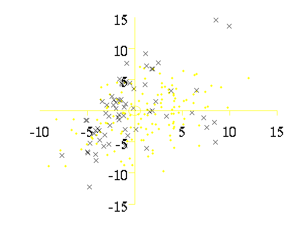
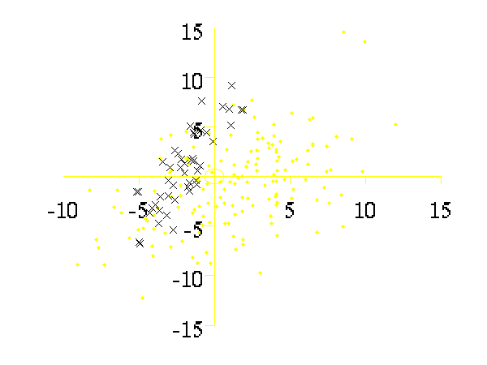
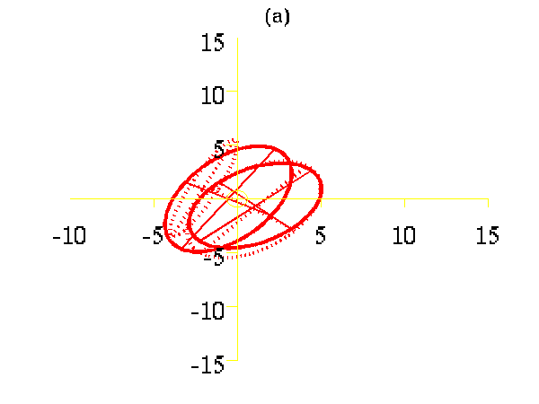
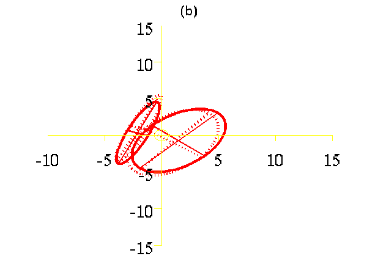
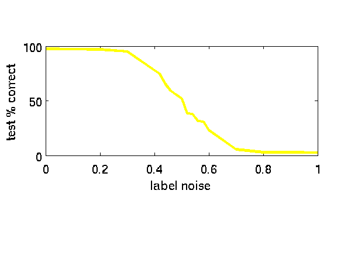
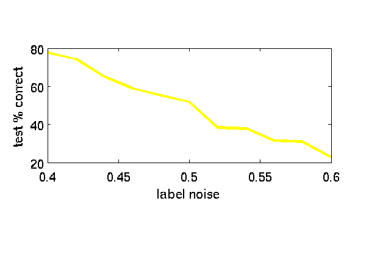

Noisy Kernel Fisher's Discriminant
==================================

This page describes examples of how to use the Noisy Kernel Fisher's Discriminant Software (NKFD).

The NKFD software can be downloaded here.

Release Information
-------------------

Current release is 0.1.

As well as downloading the NKFD software you need to obtain the toolboxes specified below. These can be downloaded using the *same* password you get from registering for the NKFD software.

| **Toolbox**                                  | **Version** |
|----------------------------------------------|-------------|
| [NETLAB](/netlab/downloadFiles/vrs3p3)       | 3.3         |
| [NDLUTIL](/ndlutil/downloadFiles/vrs0p157)   | 0.157       |
| [MLTOOLS](/mltools/downloadFiles/vrs0p127)   | 0.127       |
| [OPTIMI](/optimi/downloadFiles/vrs0p132)     | 0.132       |
| [DATASETS](/datasets/downloadFiles/vrs0p131) | 0.131       |
| [KERN](/kern/downloadFiles/vrs0p167)         | 0.167       |

First release in response to a request for the code. Code was written in 2000 but is being released for first time in 2007. The code is heavily based on the NETLAB toolbox, to such an extent that copyright from NETLAB probably applies to large portions of this software. Please see GPL licenses on that software for details of the implications of this.

Examples
--------

### Mixture of Gaussian Example

Run with demNkfd1. Recreates the toy problem results in the paper.

```matlab
>> demNkfd1
```

The results of the script are given in the plot below.


  Results from the first toy problem in the ICML 2001 paper.

### USPS Example

Run with demNkfdFourNine. I don't have access to the Cedar CDROM data, but this is a recreation of that experiment with the USPS digits four and nine.

```matlab
>> demNkfdFourNine 
```

The results of the script are given in the plot below.



### Sky Example

Another data set where I currently have no access to the data. Will release if I can find it again!

Page updated on Wed Dec 12 05:12:33 2007

